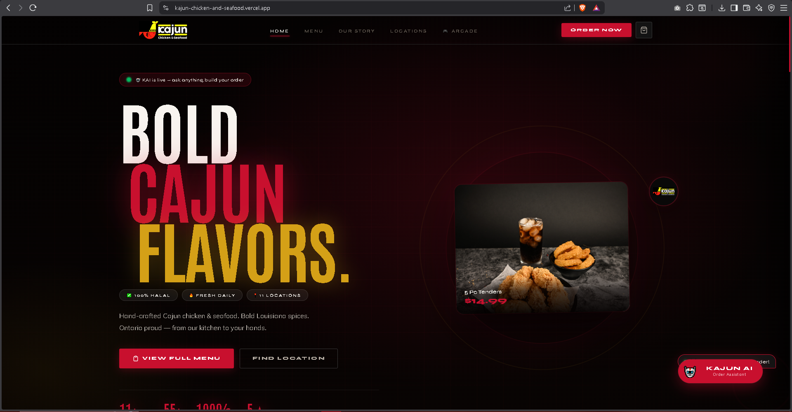
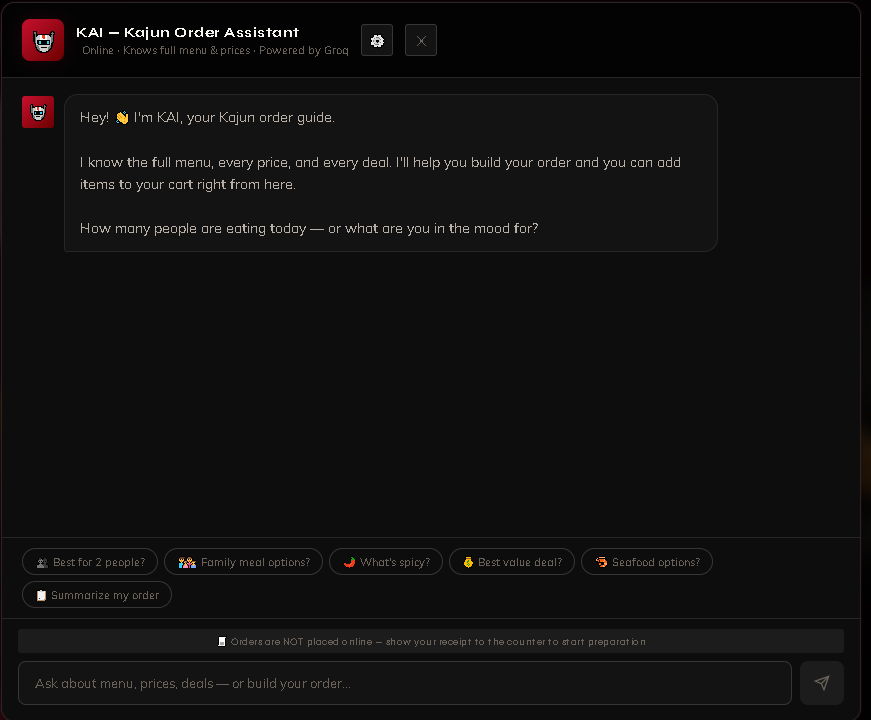
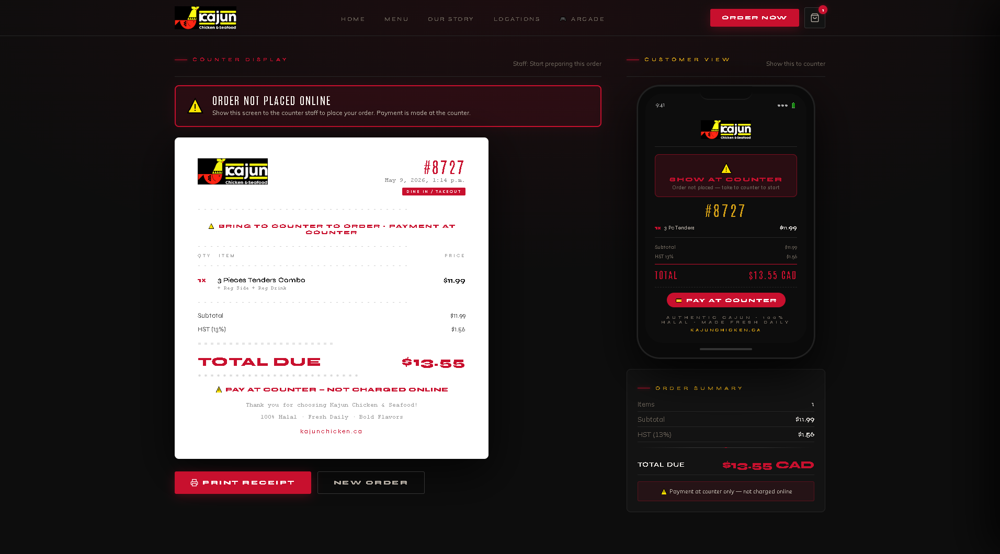
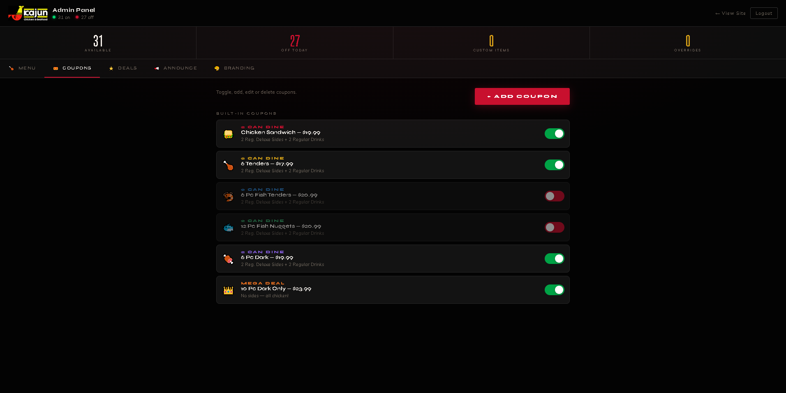

# Kajun Chicken & Seafood

> **Live site:** [kajun-chicken-and-seafood.vercel.app](https://kajun-chicken-and-seafood.vercel.app)

A complete digital storefront for Kajun Chicken & Seafood — Louisiana-rooted, family-run, eleven locations across Ontario. Marketing site, in-store ordering surface that prints to the counter, an AI ordering assistant trained on the live menu, an owner admin panel that controls everything live without a developer, and a small games arcade for the wait. Built solo, designed end-to-end.



---

## What it does

**Customer side**
- Marketing site: menu, locations (11 stores), origin story, deals, today's specials
- In-store ordering: customer builds an order on a tablet or phone, hits submit, the receipt prints at the counter for the cashier — never sends payment online (safer, simpler, matches how the stores actually run)
- KAI: an in-page AI ordering assistant that knows the entire menu, every price, every active deal, and today's availability. Helps the customer build an order in plain language and lets them add items straight to the cart from the chat
- Kajun Arcade: chess, ludo, tic-tac-toe — small games for the wait

**Operator side**
- Admin panel (password-protected) controlling menu items, prices, daily availability, coupons, announcements, and storefront branding
- Every change goes live immediately — no rebuild, no developer
- Receipts are tagged "NOT placed online — show this to the counter to start preparation," so there's never confusion about whether the kitchen has the order

---

## KAI — the in-page ordering assistant

KAI lives inside the storefront. The customer types what they're hungry for, KAI suggests options from the *currently available* menu, mentions today's deals proactively, and offers to add items to the cart directly. It will not suggest items the operator has marked as sold out today.



The chat goes through `/api/kai-chat` — a Vercel serverless function that holds the Groq key server-side (`GROQ_API_KEY` env var) and rate-limits per IP. The browser never sees credentials. A visitor who prefers to use their own Groq key can plug one in via the recovery banner; in that mode the browser hits Groq directly with their key and the shared proxy quota is preserved.

---

## How an order ends up at the counter

The site doesn't take card payments. It builds the cart, prints a clean labeled receipt, and the customer walks the receipt to the counter to pay. Same flow as ordering at the till — but the cart was built by the customer at their own pace, KAI helped them pick, and the kitchen ticket is unambiguous.



---

## Owner admin panel

Everything that needs to change day-to-day is in one panel: menu, coupons, announcements, branding. The owner toggles fish off when supply runs out, flips a coupon on for the weekend, drops a banner about a closing time — all live, no deploy.



---

## Stack

- **React + Vite** for the SPA
- **React Router** for client-side routing
- **Lenis** for smooth desktop scroll (mobile uses native scroll because iOS momentum is already great)
- **Vercel serverless functions** for the KAI proxy
- **Groq Llama 3.3 70B** as the live AI brain (with `llama3-70b-8192` and `llama3-8b-8192` fallback)
- **localStorage** for cart + admin session + visitor's optional Groq key
- No backend database — admin state lives in browser localStorage and re-renders into the static site each session

---

## Local dev

```bash
npm install
cp .env.example .env       # then set your real GROQ_API_KEY
npm run dev
```

The `.env` file is gitignored. Locally, KAI's proxy reads the key the same way the production function does (via `process.env.GROQ_API_KEY`).

---

## Deployment

Deployed on Vercel from the `main` branch.

Set `GROQ_API_KEY` under **Project Settings → Environment Variables** (Production + Preview). Never commit it. The serverless function at `api/kai-chat.js` reads it at runtime.

The same build also deploys to GitHub Pages via the included Actions workflow — `BASE_PATH` is driven by an env var so the same build works on either host.

---

## Repo layout

```
src/
├── App.jsx
├── main.jsx
├── components/         # KAI, Navbar, Footer, Cart, Toast, AnnouncementBar
├── context/            # Admin, Cart, Availability providers
├── data/               # menu, specials, coupons (JSON-shape modules)
└── pages/              # Home, Menu, Locations, About, Receipt, Admin, Landing
                        # + games/ for the arcade
api/
└── kai-chat.js         # Vercel serverless proxy for KAI → Groq
public/                 # static assets
docs/screenshots/       # screenshots used in this README
```

---

## Notes

This is an independent build for the brand and is not officially affiliated with the original business.

## Studio

Built under **Anteroom Studio**. Research, design, and engineering by Zawwar Sami.
